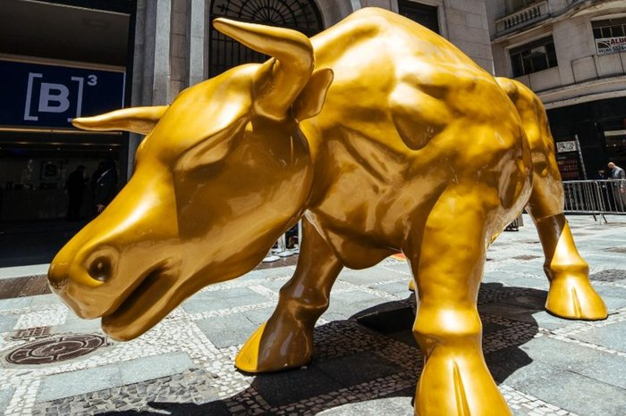
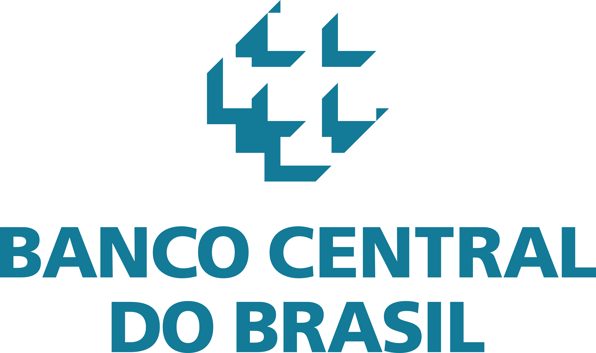
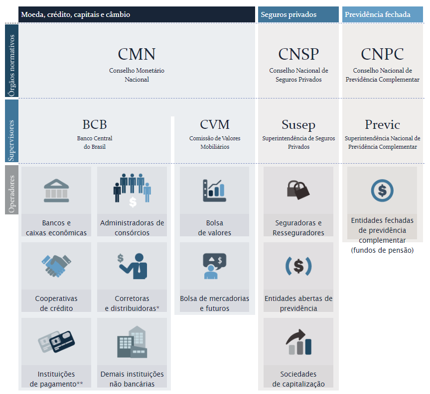
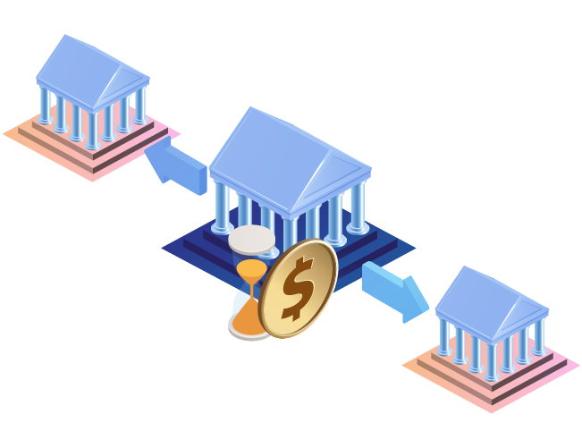

# Mercado Financeiro

Após completar este capítulo, você será capaz de:
- Compreender o que é o mercado financeiro e sua regulação
- Compreender o que são ativos e derivativos
- Distinguir os tipos de mercado e os tipos de players

## 1. O que é mercado financeiro

Mercado financeiro é o espaço onde ocorrem negociações de instrumentos ou produtos financeiros como: títulos, moedas, ações, derivativos e mercadorias. Um mercado financeiro pode ser geral ou especializado.
Cada país possui seu próprio mercado, embora seja possível ocorrer participação externa (inter-mercados).

--------
**Curiosidade**: *O que é Bull e bear market?*

As expressões *bull market* e *bear market* representam tendências opostas do mercado financeiro. *Bull Market* é um mercado de alta, enquanto que *Bear Market* é um mercado de baixa. Elas comumente se referem a estados da bolsa de valores, mas podem ser usadas para qualquer tipo de ativo ou mercado.

Você sabe de onde vieram essa expressão? 
Leia mais nesta [matéria](https://comoinvestir.thecap.com.br/bull-market-vs-bear-market-diferencas/).

----------

**Ativos financeiros** são ativos que fornecem um
fluxo de dinheiro. Representam uma promessa de
pagamento em data futura. Exemplos: ações, títulos públicos e títulos corporativos.

**Derivativos** são instrumentos financeiros que derivam seu valor de um ativo subjacente, que pode ser um ativo financeiro (ações, taxas de juros), ativos físicos (café, soja, moedas), uma taxa de referência (Selic), índice (IPCA) ou até mesmo outro derivativo. Exemplos: futuros, opções, CDS's (*Credit Default Swap*).

As principais classes de ativos negociados são:

- Mercado de capitais (renda variável: ações)
- Mercado monetário (renda fixa: títulos, taxas de juros)
- Mercado cambial (moedas estrangeiras)
- Mercado de *comoddities* (mercadorias)

O sistema financeiro também engloba o segmento de seguros privados, previdência complementar, contratos de capitalização e fundos de pensão.

## 2. Renda Fixa x Renda Variável

**Ativos de Renda Fixa**: possuem fluxos certos e pagamento incondicional. Os rendimentos são predeterminados. Por exemplo: Título público que paga cupons semestrais.

**Ativos de Renda Variável**: possuem fluxos incertos, com pagamento condicional a um evento. Por exemplo: Ações pagam dividendos condicional à existência de lucro no resultado da empresa no período.

## 3. Participantes

 vs 

Os participantes do mercado financeiro são quem negocia (compra ou vende) instrumentos financeiros (ativos ou derivativos). Há três tipos de participantes, de acordo com o a intenção da negociação:

- *Hedger*: é o agente que visa transferir seu risco para outro agente se proteger da flutuação dos preços no mercado, concentrando-se no negócio;
- Especulador: é aquele que busca lucro através da  oscilação dos preços de mercado. Sua atuação envolve uma aposta  sobre a direção dos preços, se beneficiando do diferencial entre os preços de compra e venda;
- Arbitrador: é o agente que se proveita de preços fora dos preços justos ou de diferenças entre mercados. Ele busca um "lucro sem risco" e atua como um regulador de mercados, equilibrando a oferta e a demanda, eliminando as possibilidades de arbitragem.

**Exemplo 1**

Considere o caso de uma empresa brasileira que realiza a exportação de um bem. Normalmente este tipo de operação é feita em dólares. Portanto, o custo de produção, que é realizada no Brasil é indexado em reais (moeda local), enquanto o lucro é indexado a dólar. 

Neste cenário, a variação da paridade das moedas pode afetar o balanço da empresa e é natural que ela busque se proteger desta oscilação através de contratos de derivativos como futuros ou moeda a termo. Este tipo de atuação é chamado *hedge*.

Veja que não há intenção de obter lucro, mas sim de evitar oscilações no resultado da empresa, cujo negócio principal é a produção e exportação de um bem - e não ganhos financeiros.

## 4. Órgãos reguladores

A estrutura do **Sistema Financeiro Nacional** é dividida entre:

- Órgãos normativos
- Entidades supervisoras
- Entidades operadoras

### 4.1. Órgãos Normativos

Determinam as **normas e políticas** para o bom funcionamento do Sistema Financeiro Nacional.

Os órgãos normativos são:

- CMN - [Conselho Monetário Nacional](https://www.gov.br/fazenda/pt-br/assuntos/cmn)
- CNSP - [Conselho Nacional de Seguros Privados](https://www.gov.br/fazenda/pt-br/assuntos/politica-microeconomica/atuacao-spe/conselho-nacional-seguros-privados)
- CNPC - [Conselho Nactional de Previdência Complementar](https://www.gov.br/trabalho-e-previdencia/pt-br/acesso-a-informacao/participacao-social/conselhos-e-orgaos-colegiados/conselho-nacional-de-previdencia-complementar)

#### 4.1.1. Funções do CMN

O CMN é o órgão normativo máximo do Sistema Financeiro Nacional e tem a responsabilidade de formular a política da moeda e do crédito, objetivando a estabilidade da moeda e o desenvolvimento econômico e social do País.

Composição:
- Ministro da Economia (presidente do Conselho)
- Presidente do Banco Central
- Secretário Especial de Fazenda do Ministério da Economia

As funções do CMN são:

- Estabelecer as diretrizes gerais das políticas monetária, cambial, creditícia, orçamentária e da dívida pública interna e externa;
- Regular as condições de constituição, funcionamento e fiscalização das instituições financeiras;
Adaptar o volume dos meios de pagamentos às reais necessidades da economia;
- Regular o valor interno e externo da moeda e equilíbrio do balanço de pagamentos;
Disciplinar os instrumentos de política monetária e cambial.

Mais informações: [Secretaria do CMN](https://www.bcb.gov.br/acessoinformacao/cmn)

### 4.2. Entidades Supervisoras

Fiscalizam as instituições financeiras para que os cidadãos e os integrantes do sistema financeiro sigam as regras definidas pelos órgãos normativos.

As entidades supervisoras são:

- BCB - [Banco Central do Brasil](https://www.bcb.gov.br/)
- CVM - [Comissão de Valores Mobiliários](https://www.gov.br/cvm/pt-br)
- Susep - [Superintendência de Seguros Privados](http://www.susep.gov.br)
- Previc - [Superintendência Nacional de Previdência Complementar](https://www.gov.br/economia/pt-br/orgaos/entidades-vinculadas/autarquias/previc)

    

#### 4.2.1. Funções do Banco Central

Um banco central, em geral, desempenha as seguintes funções:
- monopólio de emissão;
- banqueiro do governo;
- banco dos bancos;
- supervisor do sistema financeiro;
- executor da política monetária; e
- executor da política cambial e depositário das reservas internacionais.

Para mais informações: [Funções do Banco Central](https://www.bcb.gov.br/content/cidadaniafinanceira/Documents/publicacoes/serie_pmf/FAQ%2011-Fun%C3%A7%C3%B5es%20do%20Banco%20Central.pdf)

#### 4.2.2. Funções da CVM

As principais funções da Comissão de Valores Mobiliários são fiscalizar, normatizar, disciplinar e desenvolver o mercado de valores mobiliários. 

- Garantir a transparência do mercado de valores mobiliários;
- Organizar o funcionamento da Bolsa de Valores Brasileira; 
- Analisar as demonstrações que as empresas de capital aberto divulgam;
- Garantir que o as informações dos ativos negociados e das instituições emissoras estejam acessíveis;
- Diminuir a burocracia para investir;
- Possibilitar o acesso às informações sobre os ativos;
- E por fim, fiscalizar, conferir e punir possíveis fraudes. 

## 4.3. Entidades Operadoras

Instituições que prestam serviços ao público, no papel de **intermediário financeiro**.

Os operadores são:

- Bancos e instituições financeiras;
- Bolsa de valores;
- Corretoras.

Visão geral:

Fonte: 

[Banco Central do Brasil](https://www.bcb.gov.br/pre/composicao/composicao.asp?frame=1) 

#### 4.3.1. B3

A [B3](https://www.b3.com.br/pt_br/b3/institucional/quem-somos/) é uma das principais empresas de infraestrutura de mercado financeiro no mundo, com atuação em ambiente de bolsa e de balcão. Sociedade de capital aberto – cujas ações (B3SA3) são negociadas no Novo Mercado –, a Companhia integra os índices Ibovespa, IBrX-50, IBrX e Itag, entre outros. 

As atividades incluem:

- Criar e administrar de sistemas de negociação, compensação, liquidação, depósito e registro para todas as principais classes de ativos;
 - Operar como contraparte central garantidora para a maior parte das operações realizadas em seus mercados;
 - Oferecer serviços de central depositária e de central de registro;
 - Oferecer produtos e serviços que suportam o processo de análise e aprovação de crédito em todo o território nacional, tornando o processo de financiamento mais ágil e seguro.

#### 4.3.2 ANBIMA

A ANBIMA (Associação Brasileira das Entidades dos Mercados Financeiro e de Capitais) é uma entidade que representa as instituições do mercado de capitais, como bancos, corretoras, gestoras, entre outros.

Formada em 2009 com a fusão da ANBID (Associação Nacional dos Bancos de Investimento) com a ANDIMA (Associação Nacional das Instituições do Mercado Financeiro), é uma das maiores entidades financeiras do país.

Suas principais funções são:

- Atuar como agente regulador privado;
- Representar e defender os interesses das instituições e estimular seu crescimento;
- Informar os agentes a respeito de conteúdo produzido e adquirido pelo órgão e parceiros;
- Educar e elevar os padrões da atuação de seus associados (concede certificações profissionais);
- Estabelecer boas práticas e regras que estimular boas práticas no mercado de capitais;
- Divulgar dados estatísticos para o mercado

## 5. Bolsa, Balcão e *Clearing House*

**Mercado de bolsa** ou **pregão**: As negociações são realizadas na bolsa de valores de forma multilateral e centralizada. Para tal, as operações são padronizadas. Adicionalmente, as operações negociadas em bolsa possuem um **ajuste diário**. Exemplo de ativos negociados em bolsa: ações, opções, futuros. 

Ajuste diário é um acerto financeiro que pode ser tanto de débito quanto de crédito feito diretamente na conta do investidor na corretora. Ele funciona como um mecanismo que evita que haja uma inadimplência por parte de algum investidor. Essa equalização acontece sempre no término de cada pregão, e toma sempre como referência o preço do ajuste do pregão do dia.

No Brasil há apenas uma bolsa de valores: [B3](http://www.b3.com.br/pt_br/).

**Mercado de balcão**: As negociações são bilaterais e descentralizadas (um comprador e um vendedor). Em geral, são negociadas operações não padronizadas, como swaps, termos e diversas operações estruturadas.

Ainda que as operações de balcão não sejam centralizadas, há a necessidade de registro em uma *clearing house* ou **câmara de compensação**.

Uma câmara de compensação é uma instituição financeira formada para facilitar as transações de troca de pagamentos, valores mobiliários ou derivativos. É a instituição responsável pela liquidação e compensação de ativos do mercado financeiro.

Os Sistemas e Câmaras de Liquidação e Compensação são responsáveis por garantir segurança e transparência às operações do mercado financeiro, executando e registrando todo o processo de compra e venda.

No Brasil, há basicamente duas clearing houses em funcionamento: o Sistema Especial de Liquidação e Custódia – Selic e a Brasil, Bolsa, Balcão – B3.

Enquanto a Selic incorpora o sistema responsável pela negociação dos títulos públicos federais, a B3 atua no âmbito privado, em operações que de títulos de renda fixa e variável, entre outros.

Antigamente, havia ainda uma terceira clearing house, chamada de Central de Liquidação e Custódia de Títulos (Cetip). Em 2017, ela se fundiu com a Câmara de Ações da  BM&FBovespa, dando origem à B3, que existe até hoje.

## Referências

- ANDIMA. Disponível em www.andima.com.br
- BANCO CENTRAL DO BRASIL. Disponível em www.bacen.com.br
- BMFBOVESPA. Disponível em www.bmfbovespa.com.br
- LIMA, I.S; LIMA, G.A.S. F; PIMENTEL, R.C. Curso de Mercado - Financeiro Tópicos Especiais. São Paulo: Ed. Atlas, 2006
- SECURATO, J.R. Cálculo Financeiro de Tesourarias.São Paulo: Saint Paul Institute of Finance , 4ºed , 2008
- SILVA, P.A. Renda Fixa Objetiva. ZTG Editora, 1ºed , 2004
- TESOURO DIRETO. Disponível em www.tesourodireto.com.br